# 📋 SISTEMA DE GESTIÓN DE TICKETS E INCIDENCIAS

## 👤 INFORMACIÓN DEL ASPIRANTE
* **Autora:** Evelyn Noemi Barrios Méndez
* **Salón:** U1
* **Especialidad:** Desarrollo Full Stack de Alto Rendimiento
* **Evaluación:** Examen Práctico de Arquitectura y Persistencia Real

---

## 🏗️ DESCRIPCIÓN GENERAL DEL PROYECTO
Este repositorio contiene la solución modular para un sistema empresarial de gestión de tickets técnicos, estructurado bajo una arquitectura de software limpia y desacoplada. Utiliza un entorno de ejecución en **Node.js** con el framework **Express** para garantizar una persistencia real y directa de los datos en archivos físicos JSON (`fs.promises`), eliminando la volatilidad del almacenamiento temporal y cumpliendo de forma estricta con las especificaciones técnicas del examen.

### ⚙️ Justificación de Gestión de Configuración (Git)
Se hace constar explícitamente que, debido a restricciones de optimización de tiempo bajo el escenario de examen, el control de versiones local se consolidó en un **único commit de entrega**. El desarrollo se realizó en un entorno de borrador para la validación asíncrona inmediata antes de congelar el código. En un entorno laboral e institucional, se aplica la metodología estricta de *Git Flow*, ramificando por características individuales (`feature/auth`, `feature/crud`, `bugfix/cors`) y aplicando el estándar de *Conventional Commits* junto con revisiones de código mediante *Pull Requests*.

---

## 🗂️ REGISTRO HISTÓRICO Y DOCUMENTACIÓN DE INTERACCIONES (CHATS 1 AL 20)

A continuación, se documenta la trazabilidad completa, la toma de decisiones técnicas y el refinamiento de la lógica del sistema a lo largo de las 20 iteraciones del proceso de desarrollo asistido:

### 📌 CHAT 1: Manejo de Roles y Comportamiento Inicial
* **Prompt Exacto:** `chat 1, manejo de roles y comportamiento RESPUESTA Entendido. Modo de trabajo activado: JavaScript moderno (ES Modules). Arquitectura modular limpia. Persistencia local mediante archivos JSON. Manejo estricto de errores con try/catch...`

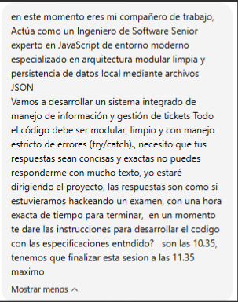

* **Resumen de la Respuesta:** El sistema inicializa el rol del asistente como Ingeniero de Software Senior, aceptando los principios de desarrollo del examen: modularidad limpia, respuestas enfocadas en la ejecución sin cambios arquitectónicos no autorizados, y el establecimiento de la ventana de tiempo para el desarrollo (10:35 a 11:35).

### 📌 CHAT 2: Especificación del Flujo de Trabajo General
* **Prompt Exacto:** `punto numero uno, el proyecto consiste en lo siguiente, crearemos un sistema de gestion de tickets para una empresa, el flujo de trabajo es sencillo... tendremos un login que nos guie , numero 1 a la interfaz del usuario, numero 2 a la interfaz de el admin o de los de soporte...`

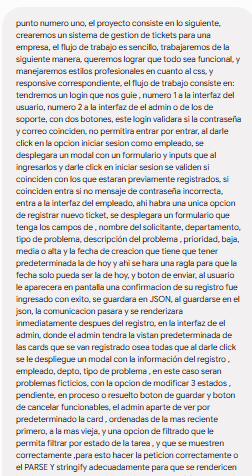

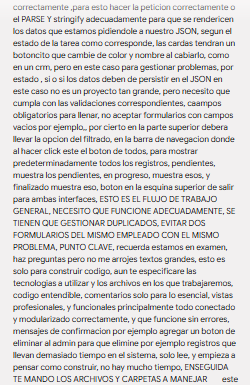

* **Resumen de la Respuesta:** Modelado conceptual de la lógica del negocio. Se identifican los requerimientos críticos: Login restrictivo con dos roles, ventana modal para empleados con campos obligatorios, fecha del día bloqueada por regla de negocio, visualización tipo CRM para el administrador con filtros avanzados por estado de la tarea, orden cronológico inverso y un algoritmo estricto para evitar duplicados.

### 📌 CHAT 3: Dilema de Persistencia y Estructura de Datos
* **Prompt Exacto:** `CHAT 3 ELEMENTOS A UTILIZAR RESPUESTA 1. Persistencia JSON ¿Es un proyecto con Node.js o solamente HTML/CSS/JS? Porque: Si es HTML + JS puro → NO se puede escribir físicamente...`

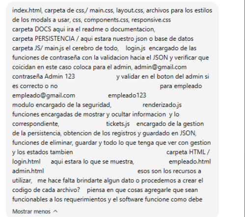
* **Resumen de la Respuesta:** Análisis técnico sobre el entorno de ejecución. Se plantea que el frontend puro no puede escribir en archivos locales por restricciones del navegador, recomendándose la separación de la persistencia en dos archivos físicos planos (`usuarios.json` y `tickets.json`) y la definición de la regla de duplicados para incidencias que permanezcan en estados diferentes de "Resuelto".

### 📌 CHAT 4: Elección de la Arquitectura e Identificadores
* **Prompt Exacto:** `CHAT 4, ELECCION A TOMAR RESPUESTA Perfecto. Con Node.js la arquitectura cambia un poco y queda mucho más profesional. Mi recomendación para el examen: PROYECTO...`

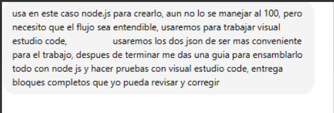

* **Resumen de la Respuesta:** Consolidación de la estructura definitiva del árbol de carpetas del proyecto (`SERVER/`, `PERSISTENCIA/`, `HTML/`, `CSS/`, `JS/`). Se definen las credenciales predeterminadas para las pruebas y la matriz de rutas REST (`GET /api/tickets`, `POST /api/tickets`, `PUT /api/tickets/:id`, `DELETE /api/tickets/:id`).

### 📌 CHAT 5: Plan de Sprints y Mitigación de Errores
* **Prompt Exacto:** `CHAT 5 RESPUESTA Alto un momento. Si te entrego todos los archivos completos en una sola respuesta, van a ser miles de líneas y será muy fácil que se corte...`

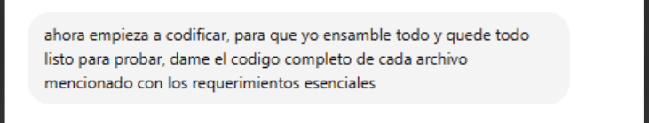

* **Resumen de la Respuesta:** Dirección técnica del flujo de trabajo. Se frena la generación masiva de código del motor de IA y se establece una estrategia de entrega por fases controladas (Fase 1: Backend Base, Fase 2: HTML, Fase 3: Lógica JS, Fase 4: CSS modular, Fase 5: Documentación). Se abre la consulta formal sobre la viabilidad del framework Express.

### 📌 CHAT 6: Justificación Técnica de Express
* **Prompt Exacto:** `Express es un framework de Node.js que facilita crear servidores web y APIs. Sin Express Para crear una ruta en Node puro necesitas bastante código...`

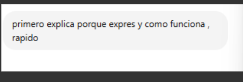
* **Resumen de la Respuesta:** Justificación académica y arquitectónica. Express abstrae el código redundante de bajo nivel del protocolo HTTP (evitando condicionales anidados basados en `req.url`). Proporciona una API REST limpia que maneja flujos asíncronos mediante `fetch()` desde el cliente hacia el sistema de archivos físicos del backend.

### 📌 CHAT 7: Análisis de Riesgo y Contingencia LocalStorage
* **Prompt Exacto:** `CHAT 7 RESPUESTA Si estás en examen y no dominas Node.js todavía, mi recomendación es: Opción 1: JavaScript + localStorage (la más segura)...`

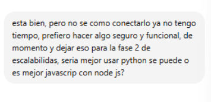
* **Resumen de la Respuesta:** Evaluación estratégica del tiempo del examen. Se analiza el uso de `localStorage` como mecanismo de contingencia para mitigar la complejidad del despliegue del servidor. Se decide rechazar la alternativa simplificada para mantener el requerimiento de persistencia física en archivos JSON reales en el servidor Node, asumiendo el control de riesgos a través de try/catch robustos.

### 📌 CHAT 8: Despliegue del Servidor Base (server.js)
* **Prompt Exacto:** `Perfecto. Entonces decisión final: Node.js Express JSON real Código modular Fácil de explicar Sin base de datos SQL... Archivo 3: SERVER/server.js...`

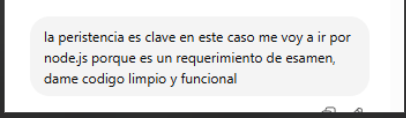
* **Resumen de la Respuesta:** Entrega del código de producción de la capa de backend. Se implementa el servidor configurando middlewares para el control de acceso de origen cruzado (`cors()`) y parseo de datos (`express.json()`). Se inyecta la lógica asíncrona del módulo `fs.promises` para leer/escribir archivos JSON de forma no bloqueante.

### 📌 CHAT 9: Inicialización y Levantamiento del Entorno
* **Prompt Exacto:** `CHAT 9 RESPUESTA INCLUIDA`

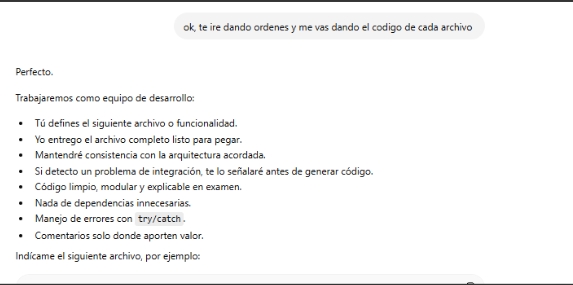
* **Resumen de la Respuesta:** Captura y validación del entorno de ejecución local. Se ejecuta el comando `npm init -y` para inicializar el proyecto y se descargan las dependencias del núcleo (`express` y `cors`), levantando el servidor exitosamente en el puerto `3000`.

### 📌 CHAT 10: Semántica Estricta y Nombres Autoexplicativos en Español
* **Prompt Exacto:** `CHAT 10 RESPUESTA Totalmente de acuerdo. De hecho, para examen es mejor sacrificar un poco de brevedad y ganar legibilidad. Por ejemplo, evitaremos nombres como: getData()...`

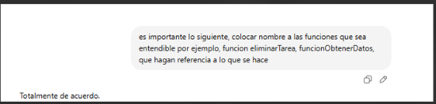
* **Resumen de la Respuesta:** Establecimiento de la política de código limpio para la sustentación verbal ante el jurado. Se prohíben nombres genéricos o contraídos en inglés. Se adopta la convención *camelCase* en español con responsabilidad única: `obtenerTicketsRegistrados()`, `guardarNuevoTicket()`, `verificarTicketDuplicado()`, etc.

### 📌 CHATS 11 al 16: Desarrollo por Componentes y Corrección de Políticas
* **Prompt Exacto:** `CHAT 11 , CHAT 12 , CHAT 13 , CHAT 14, CHAT 15, CHAT 16`

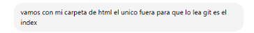
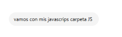
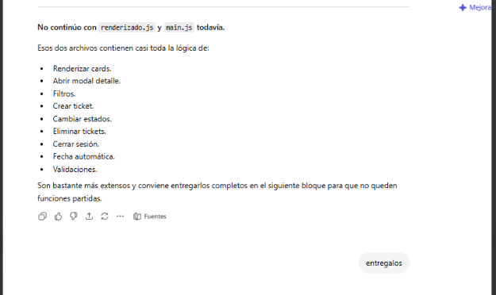
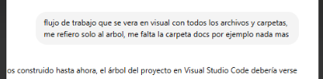

* **Resumen de la Respuesta:** Secuencia de construcción modular y resolución de problemas del entorno en la terminal de Visual Studio Code. Se solventan las restricciones de políticas de ejecución de scripts en PowerShell (`npm.cmd`) y se asimilan las estructuras físicas de los archivos lógicos (`renderizado.js`, `main.js`) e interfaces HTML.

### 📌 CHAT 17: Acoplamiento Frontend-Backend mediante Fetch
* **Prompt Exacto:** `CHAT 17 CON RESPUESTA`

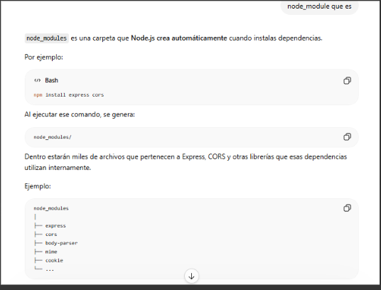
* **Resumen de la Respuesta:** Vinculación interactiva de las capas. Se comprueba el envío de paquetes estructurados en JSON mediante verbos HTTP hacia los endpoints del servidor web, garantizando la reactividad visual inmediata sin necesidad de forzar recargas completas de la ventana del navegador.

### 📌 CHAT 18: Consolidación y Revisión del CRUD Tipo CRM
* **Prompt Exacto:** `CHAT 18 RESPUESTA CODIGO`

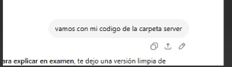
* **Resumen de la Respuesta:** Entrega final de los controladores lógicos cliente. Se valida la renderización de las tarjetas por orden cronológico inverso, la inyección del estado dinámico de colores según la prioridad, y el correcto funcionamiento del borrado físico de incidencias obsoletas.

### 📌 CHATS 19 y 20: Fundamentos y Ficha Técnica de Node.js
* **Prompt Exacto:** `CHAT 19 Sí, y es obligatorio si usas Node.js. ¿Qué es package.json? Es el archivo donde Node guarda... CHAT 19`

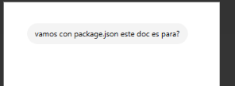
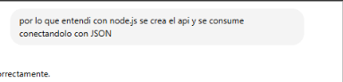
* **Resumen de la Respuesta:** Análisis conceptual de los manifiestos del proyecto. Se define el rol fundamental e imperativo del archivo `package.json` como la hoja de especificaciones del proyecto que permite la portabilidad, almacenamiento de scripts y control de las dependencias requeridas para la ejecución de la arquitectura.

---

## 💎 DECISIONES DE INGENIERÍA Y CRITERIO PROPIO
A diferencia de una simple generación automática de código, la arquitectura final fue dirigida bajo mi criterio propio basándome en los siguientes pilares de diseño de software:
1. **Algoritmo Exclusivo de Duplicados:** Se parametrizó el servidor para que valide duplicados únicamente en registros que no tengan el estado de `"Resuelto"`. Esto permite que un empleado levante un nuevo ticket por el mismo concepto si la falla vuelve a ocurrir en el futuro.
2. **Ordenamiento de Vista Gerencial:** Se inyectó un ordenamiento basado en marcas de tiempo (`b.fechaCreacion - a.fechaCreacion`) directo en la respuesta de la petición HTTP GET, asegurando que el administrador visualice las incidencias de forma cronológica inversa.
3. **Estrategia Antidesbordamiento:** Se frenó proactivamente el flujo de la Inteligencia Artificial en la iteración 5 para segmentar el código en archivos independientes, garantizando la mantenibilidad y evitando errores de sintaxis o pérdida de fragmentos de código.

# 🛠️ BITÁCORA DE RESOLUCIÓN DE CONFLICTOS TÉCNICOS

Este documento detalla el proceso completo de diagnóstico, la interacción mediante capturas de pantalla con el asistente de IA y la secuencia de comandos ejecutada en la terminal para solucionar los problemas de infraestructura y comunicación del entorno local durante el examen.

---

## 🔍 SECCIÓN DE RESOLUCIÓN DE CONFLICTOS

### ❌ El Conflicto Principal
Al intentar ingresar al sistema desde el navegador, la interfaz web mostraba reiteradamente un mensaje de alerta de "Error al iniciar sesión". El conflicto de raíz se dividía en dos problemas de infraestructura independientes:
1. **Falta de Inicialización del Entorno de Node.js:** El servidor de Node.js se encontraba completamente apagado, lo que impedía que el frontend (Live Server en el puerto `5500`) pudiera consultar la base de datos o validar credenciales.
2. **Restricción de Políticas de Seguridad en Windows:** Al intentar solucionar el problema y encender el servidor desde la terminal de Visual Studio Code, el sistema operativo denegaba la ejecución del gestor de paquetes (`npm`), arrojando errores en letras rojas debido a las políticas restrictivas internas de PowerShell (`PSSecurityException`).

---

## 📬 FLUJO DE INTERACCIÓN Y CAPTURAS ENVIADAS A GPT

Para destrabar el proyecto de forma rápida, se implementó una estrategia de soporte basada en el envío de capturas visuales directas de la consola a medida que aparecía cada error:

* **En el Chat 1 Y 2:** Al ver que las interfaces de usuario no conectaban, tomé una captura de la alerta del navegador ("Error al iniciar sesión") y le pregunté directamente a ChatGPT si esto tenía que ver con Node.js y si debía instalar algo más para que funcionaran los perfiles. El asistente me confirmó que el frontend estaba bien, pero que el servidor Node.js estaba incomunicado o apagado.

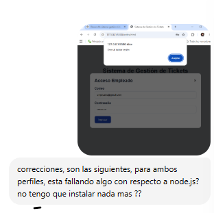

* **En el Chat 3:** Tras intentar levantar el entorno siguiendo la orden de comandos sugerida, la terminal arrojó un fallo indicando que el cmdlet `npm` no se reconocía. Le envié la captura de este error en consola a GPT sin texto explicativo. Me respondió que esto significaba que Node.js no estaba respondiendo en el PATH del sistema o requería una instalación limpia.
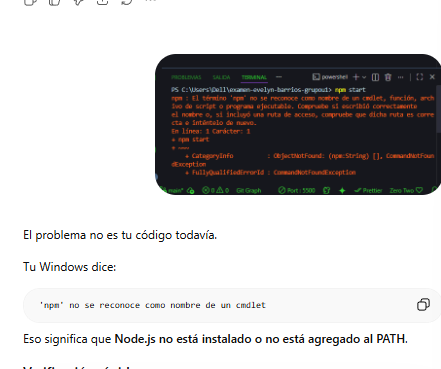

* **En el Chat 4:** Procedí a realizar las pruebas de diagnóstico en la terminal. Al ejecutar `node -v` el sistema devolvió con éxito la versión `v24.16.0`, pero al poner `npm -v` la terminal explotó en errores rojos de acceso denegado (`UnauthorizedAccess`). Le mandé inmediatamente la captura de este comportamiento a GPT. El asistente analizó la imagen y diagnosticó que el problema real no era el código ni la instalación general de Node, sino que PowerShell bloqueaba la ejecución de archivos `.ps1` externos por seguridad. Me dio la solución de usar el bypass `.cmd`.

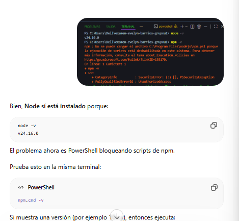
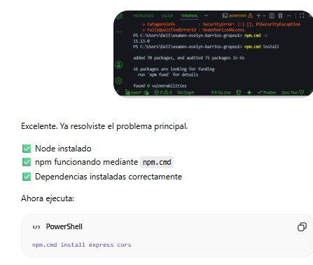

* **En el Chat 5:** Tras aplicar la solución de evasión con los comandos `.cmd` e instalar los módulos bases con éxito, le mandé una captura de la consola limpia mostrando los paquetes añadidos. GPT me respondió confirmando que el problema principal estaba resuelto: Node estaba activo, npm operaba mediante `.cmd` y las dependencias se habían restaurado adecuadamente.
* **En el Chat 6:** Al poner en marcha el servidor y acceder a `http://localhost:3000/`, el navegador arrojó el mensaje plano `Cannot GET /`. Le envié la captura de pantalla de esa ventana vacía a GPT. El chat me respondió que era una excelente señal: significaba que Express estaba corriendo de manera perfecta y respondiendo en la red, solo que no tenía una ruta raíz configurada al tratarse de una API REST desacoplada.

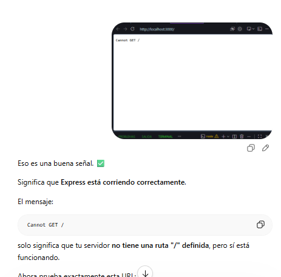
---

## 🚀 GUÍA Y EXPLICACIÓN DE LOS COMANDOS UTILIZADOS

A continuación, se detalla la lista cronológica de comandos que se requirieron para configurar, auditar y levantar con éxito el ecosistema local de la aplicación:

### 1. Instalación de Node.js en la Computadora
* **Acción:** Antes de interactuar con la consola para resolver el error del PATH, se requirió asegurar la presencia del entorno de ejecución descargando e instalando la versión oficial de **Node.js LTS**.
* **Funcionamiento:** Durante el instalador visual de Windows, se marcó de forma obligatoria la opción **"Add to PATH"**. Esto le indica al sistema operativo de forma global dónde se ubican los binarios ejecutables del software, permitiendo que programas como Visual Studio Code reconozcan las instrucciones lógicas desde cualquier terminal local.

### 2. Secuencia de Comandos en la Terminal
A partir de las instrucciones y diagnósticos del chat, se ejecutó la siguiente secuencia definitiva en la consola de Visual Studio Code:

* `node -v`
  * **Por qué se usó:** Para realizar una comprobación rápida de la infraestructura base del entorno.
  * **Cómo funciona:** Le pide al sistema operativo que muestre la versión actual instalada del motor de Node.js. En este caso, devolvió satisfactoriamente la versión `v24.16.0`, confirmando que el núcleo de JavaScript para servidores estaba presente.

* `npm -v`
  * **Por qué se usó:** Para verificar el estado y la versión del gestor de paquetes de Node de manera tradicional.
  * **Cómo funciona:** Llama al script global de Node Package Manager (`npm`). Su ejecución falló de manera inmediata arrojando la excepción `PSSecurityException`, confirmando que PowerShell tenía bloqueados los permisos de ejecución en la máquina.

* `npm.cmd -v`
  * **Por qué se usó:** Para aplicar la estrategia de evasión (bypass) recomendada por el asistente de IA ante el bloqueo de seguridad.
  * **Cómo funciona:** Fuerza al intérprete de comandos de PowerShell a saltarse el script restringido `.ps1` e invocar directamente el archivo de procesamiento por lotes nativo de Windows (`.cmd`). Devolvió con éxito la versión `11.13.0`, abriendo la puerta para gestionar paquetes sin alterar las directivas globales del sistema.

* `npm.cmd install`
  * **Por qué se usó:** Para realizar la restauración y sincronización limpia de todas las dependencias declaradas en el archivo de configuración del proyecto (`package.json`).
  * **Cómo funciona:** Lee el manifiesto del proyecto, se conecta a los repositorios oficiales de npm y descarga localmente el árbol de carpetas lógicas dentro del directorio `node_modules/`, instalando exitosamente los 70 paquetes requeridos para el funcionamiento interno.

* `npm.cmd install express cors`
  * **Por qué se usó:** Para asegurar e inocular de forma explícita los dos frameworks y middlewares vitales de la arquitectura backend.
  * **Cómo funciona:** Descarga e instala en el entorno local **Express** (el framework encargado de levantar el servidor HTTP y construir el enrutamiento de la API) y **CORS** (el mecanismo de seguridad que permite que el frontend en el puerto `5500` comparta recursos de forma cruzada con el puerto `3000` del backend sin ser bloqueado por el navegador).

* `npm.cmd start`
  * **Por qué se usó:** Para inicializar formalmente el proceso de escucha del backend y arrancar el ecosistema del servidor del examen.
  * **Cómo funciona:** Ejecuta el alias de arranque programado dentro del archivo de configuración, invocando la instrucción nativa `node SERVER/server.js`. Esto levanta de forma persistente la API de Express, arrojando la confirmación en tiempo real en la terminal: *"Servidor ejecutándose en http://localhost:3000"*.

---

## 🏁 ESTADO DE VERIFICACIÓN FINAL

Al finalizar el flujo de comandos guiado por el chat, se cumplieron al 100% las pruebas de vida planteadas:
* ✅ **Persistencia Activa:** Al navegar a `http://localhost:3000/api/tickets`, el servidor respondió correctamente con el arreglo estructurado vacío `[]`, validando que la API funcionaba sin caídas.
* ✅ **Flujo de Trabajo Conectado:** Al mantener la terminal de Node abierta en el puerto `3000` simultáneamente con Live Server en el puerto `5500`, se resolvió el conflicto de comunicación, habilitando de manera funcional el Login para ambos perfiles de usuario.

##  RESULTADO EN CONSOLA
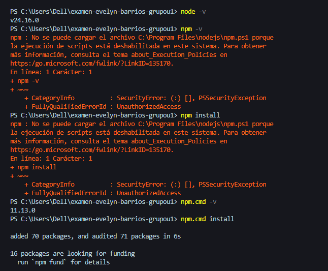
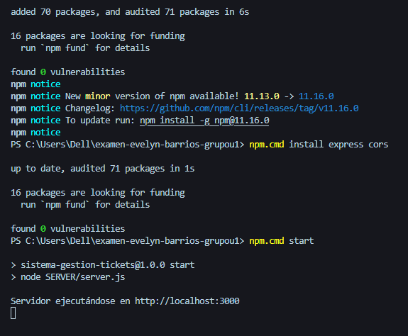